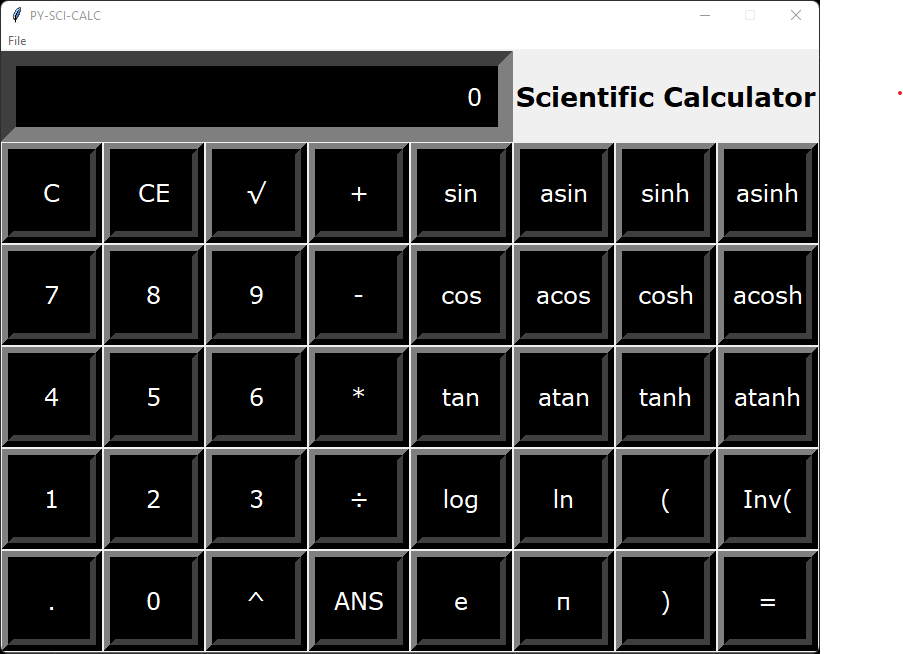

# PY-SCI-CALC
A graphical python scientific calculator.

## CODE EXECUTION
- `python src.py` (Windows)
- `python3 src.py` (Linux)

## FINAL OUTPUT

## FEATURES
1. Basic Arithmetic Functions 
   1. Addition (+)
   2. Subtraction (-)
   3. Multiplication (*)
   4. Division(÷)
2. Trigonometric Functions 
   1. sine (sin)
   2. cosine (cos)
   3. tangent (tan)
3. Logarithmic Functions
   1. Natural Log (ln)
   2. Common Log (log)
4. Hyperbolic Functions 
   1. Hyperbolic sine (sinh)
   2. Hyperbolic cosine (cosh)
   3. Hyperbolic tangent (tanh)
5. Inverse Trigonometric Functions
   1. Inverse sine (asin)
   2. Inverse cosine (acos)
   3. Inverse tangent (atan)
6. Miscellaneous Functions
   1. Exponent (^)
   2. Decimal Point (.)
   3. Square Root (√)
   4. Inverse (Inv)
   5. Brackets ((,))
7. Constants
   1. pi (π)
   2. Euler's Number (e)

## MODULES
- tkinter
- math

***More Info is available in the source code "src.py"***
